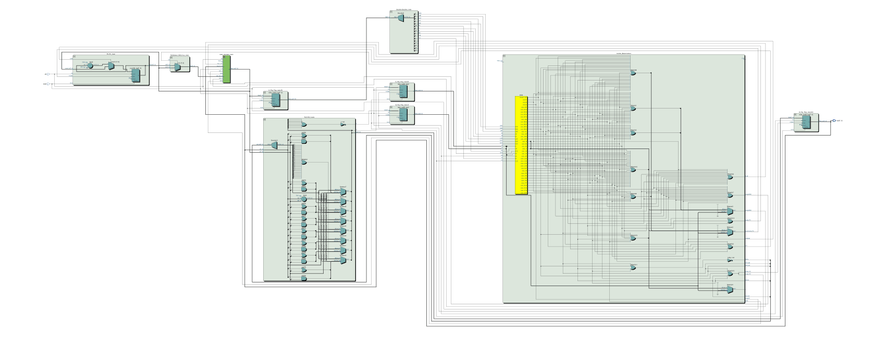
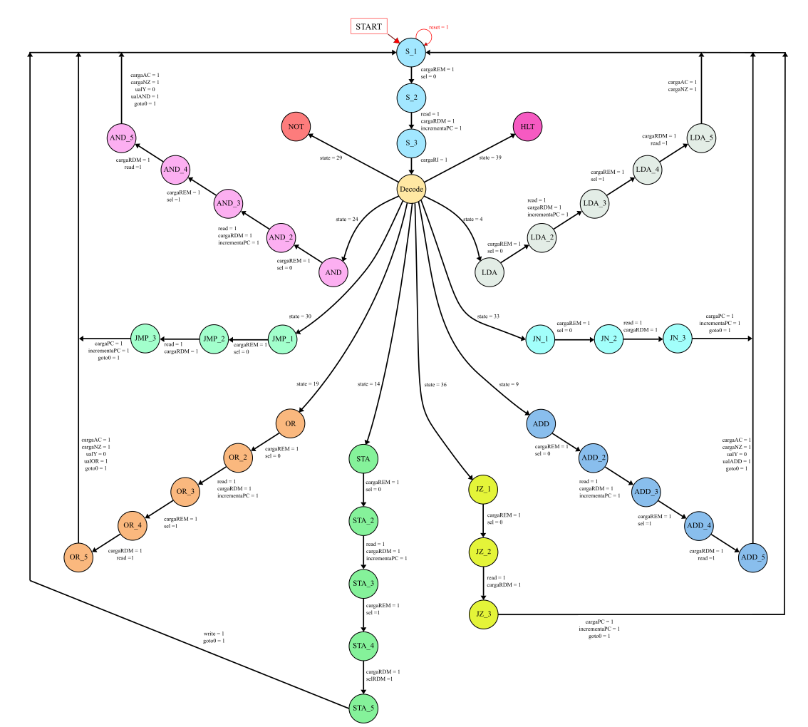

# Neander-CPU

An 8-bit modularized Verilog implementation of the **Neander** CPU architecture, an accumulator-based processor model widely used for computer architecture and hardware design studies.

---

## 📋 Table of Contents
1. [Overview](#-overview)
2. [Repository Structure](#-repository-structure)
3. [Running the Code](#-running-the-code).
4. [Architecture & Datapath](#-architecture--datapath)
5. [Instruction Set Architecture (ISA)](#-instruction-set-architecture-isa)
6. [Finite State Machines (FSM)](#-finite-state-machines-fsm)
   - [1. Control Block FSM](#1-control-block-fsm)
   - [2. Memory System FSM](#2-memory-system-fsm)
7. [Submodule Breakdown](#-submodule-breakdown)
9. [Simulation & Waveforms](#-simulation--waveforms)

---

## 🔍 Overview

The Neander architecture is a classic 8-bit accumulator-based computer model. This repository contains Verilog HDL design files implementing the CPU datapath, instruction decoding, control unit state machines, memory subsystem, and testbenches.

Key characteristics:
- **Data & Address Width**: 8-bit data bus and 8-bit memory address space (256 bytes memory capacity).
- **Architecture Type**: Accumulator-based CPU, Von-Neumman.
- **Condition Flags**: `N` (Negative) and `Z` (Zero).
- **Execution Scheme**: Micro-sequenced Finite State Machine controlling instruction fetch, decode, and execution cycles.

---

## 📁 Repository Structure

```
.
├── Neander_Modularizado/           # Modularized Verilog source modules
│   ├── Main.v                     # Top-level module interconnecting datapath and control
│   ├── Control_Block.v            # Central Control Unit FSM
│   ├── mem_sis.v                  # 256-byte RAM Memory Subsystem FSM
│   ├── ALU.v                      # 8-bit Arithmetic Logic Unit
│   ├── PC.v                       # Program Counter (8-bit)
│   ├── decoder.v                  # Instruction Opcode Decoder
│   ├── Multiplexer_8bits.v        # 8-bit 2-to-1 Multiplexer
│   ├── D_Flip_Flop_main.v         # N-bit Register / Flip-Flop
│   ├── D_Flip_Flop.v              # Single-bit Flip-Flop
│   ├── Counter.v                  # 3-bit Counter
│   └── Temporization_architecture.v # Timing signal generator
├── All_Together/                   # Single-file combined design & testbenches
│   ├── All_Together.v             # Full CPU design consolidated in one file
├── testbenches/                    # Independent module testbenches
│   ├── mem_sis_tb.v               # Memory subsystem testbench
│   └── testbenchmain.v            # Main CPU testbench
└── README.md                       # Project documentation
```

---

## ▶️ Running the Code

For a complete CPU simulation, the recommended design file is the consolidated implementation located in:

```text
All_Together/All_Together.v
```

The recommended testbench is:

```text
testbenches/testbenchmain.v
```

### 1. Compile with Icarus Verilog

From the repository root directory, compile the design and testbench using:

```bash
iverilog -Wall -g2005 -o neander.vvp All_Together/All_Together.v testbenches/testbenchmain.v
```

Where:

* `-Wall` enables compiler warnings.
* `-g2005` enables the Verilog-2005 language standard.
* `-o neander.vvp` defines the generated simulation executable.

### 2. Run the Simulation

After compilation, execute the generated simulation file with:

```bash
vvp neander.vvp
```

The testbench will execute the processor simulation and generate the corresponding VCD waveform file, provided that waveform dumping is enabled in the testbench.

### 3. View the Waveforms

The generated `.vcd` file can be opened using GTKWave:

```bash
gtkwave neander.vcd
```

Replace `neander.vcd` with the actual VCD filename defined in the testbench if a different name is being used.

The complete workflow is therefore:

```bash
iverilog -Wall -g2005 -o neander.vvp All_Together/All_Together.v testbenches/testbenchmain.v
vvp neander.vvp
gtkwave neander.vcd
```


---

## 🏗️ Architecture & Datapath

The Neander CPU consists of the following key functional units:

- **Program Counter (PC)**: 8-bit register holding the memory address of the next instruction/operand to be fetched.
- **Accumulator (AC)**: 8-bit register storing intermediate data and arithmetic/logic results.
- **Instruction Register (RI)**: 8-bit register storing the opcode of the currently executing instruction.
- **Memory Address Register (REM)**: 8-bit register holding addresses directed to the RAM.
- **Memory Data Register (RDM)**: 8-bit register buffering data read from or written to RAM.
- **Arithmetic Logic Unit (ALU)**: Executes operations on AC and RDM outputs (`ADD`, `OR`, `AND`, `NOT`, and pass-through `Y`), updating `N` and `Z` flags.
- **Instruction Decoder**: Decodes the 4 most significant bits (`Op[7:4]`) of RI into instruction control lines.
- **Multiplexer (MUX)**: Selects between PC and memory data outputs to feed into REM.

  Representation of Implemented Architecture:
  

  For more details check the images/Architecture_Modules.pdf

---

## 📜 Instruction Set Architecture (ISA)

The Neander processor utilizes 4-bit opcodes (`Op[7:4]`):

| Instruction | Opcode (Hex) | Opcode (Binary) | Description |
| :--- | :---: | :---: | :--- |
| **NOP** | `0x0` | `0000` | No Operation |
| **STA** | `0x1` | `0001` | Store AC content into memory address |
| **LDA** | `0x2` | `0010` | Load AC with content from memory address |
| **ADD** | `0x3` | `0011` | Add memory content to AC (`AC <- AC + M[addr]`) |
| **OR**  | `0x4` | `0100` | Bitwise OR memory content with AC (`AC <- AC \| M[addr]`) |
| **AND** | `0x5` | `0101` | Bitwise AND memory content with AC (`AC <- AC & M[addr]`) |
| **NOT** | `0x6` | `0110` | Bitwise NOT on AC (`AC <- ~AC`) |
| **JMP** | `0x8` | `1000` | Unconditional Jump to address |
| **JN**  | `0x9` | `1001` | Jump if Negative flag (`N = 1`) |
| **JZ**  | `0xA` | `1010` | Jump if Zero flag (`Z = 1`) |
| **HLT** | `0xF` | `1111` | Halt instruction execution |

---

## 🔄 Finite State Machines (FSM)

The system relies on two key Finite State Machines:

### 1. Control Block FSM
The Control Block FSM (`Control_Block.v`) manages instruction fetch (`search1` -> `search2` -> `search3`), instruction decoding (`decode_state`), and execution sequences for each instruction in the ISA.

<!-- PLACEHOLDER FOR CONTROL BLOCK FSM IMAGE -->


---

### 2. Memory System FSM
The Memory System FSM (`mem_sis.v`) handles RAM access synchronization and memory operations (`wait_m`, `read_m`, `write_m`, and `clear_m`).


---

## ⚙️ Submodule Breakdown

- **`Main.v`**: Top-level module wiring `PC`, `AC`, `RI`, `ALU`, `Control_Block`, `decoder`, `Multiplexer_8bits`, and `mem_sis`.
- **`Control_Block.v`**: FSM emitting control signals (`cargaRI`, `selRDM`, `carga_AC`, `carga_NZ`, `carga_PC`, `incrementa_PC`, `cargaREM`, `sel`, `write`, `read`, ALU operation triggers).
- **`mem_sis.v`**: 256x8-bit memory array with FSM control for synchronized read and write operations.
- **`ALU.v`**: Performs arithmetic and logical operations, setting status bits `n` (sign bit) and `z` (zero check).
- **`PC.v`**: 8-bit counter supporting sequential increment and direct load operations for jumps.
- **`decoder.v`**: 4-to-16 instruction opcode decoder.

---

## 🧪 Simulation & Waveforms

Testbenches and VCD waveform output files are provided for verifying design behavior:
- Run testbenches using Verilog simulators like Icarus Verilog (`iverilog`) or ModelSim.
- View `.vcd` files (e.g., `neander.vcd`, `mem_sis.vcd`, `dump.vcd`) using **GTKWave**.

